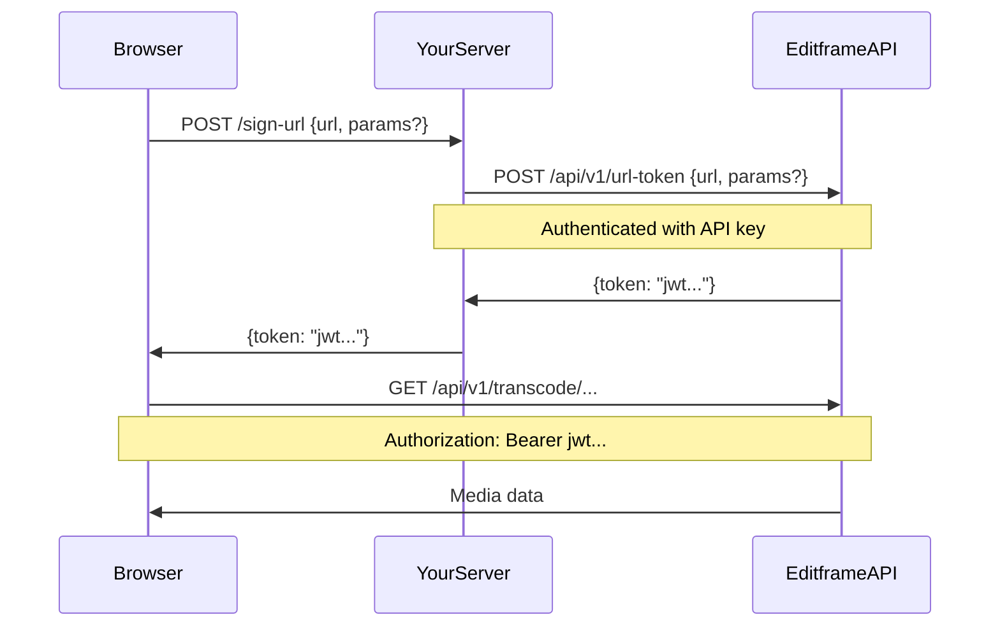

# URL Signing

URL signing enables browsers to access Editframe's media endpoints without exposing your API key.

## The Problem

Your backend has an API key. Your browser needs to play video from Editframe's CDN. You cannot put the API key in the browser — it would grant full access to your account.

URL signing solves this: your backend generates a short-lived, scoped token that authorizes the browser to access a specific URL. The token expires after a set time (typically 1 hour) and only works for the URL it was created for.

## When You Need URL Signing

**You need URL signing if:**
- Your application renders Editframe compositions in a browser
- You use `<ef-video>`, `<ef-audio>`, or other media elements with `src` pointing to Editframe URLs
- You need browser access to `/api/v1/transcode/*` endpoints for adaptive streaming

**You don't need URL signing if:**
- You only render videos server-side (using `createRender` and `downloadRender`)
- All media playback happens in your backend

## How It Works



1. Browser needs to access a media URL
2. Browser POSTs `{ url, params? }` to your signing endpoint
3. Your server calls `createURLToken(client, payload)` — passing the full payload through
4. Editframe returns a signed JWT scoped to that URL prefix + params
5. Browser uses the JWT to access the media URL

## Implementation

### Server-Side: Token Generation

Create an endpoint that proxies to `/api/v1/url-token`:

```typescript
// server.js
import express from "express";
import { Client, createURLToken, signingRequestSchema } from "@editframe/api";

const app = express();
const client = new Client(process.env.EDITFRAME_API_KEY);

app.post("/sign-url", express.json(), async (req, res) => {
  try {
    // Parse and validate the request body — signingRequestSchema is a Zod schema
    // that types the payload as { url: string, params?: Record<string, string> }
    const payload = signingRequestSchema.parse(req.body);
    const token = await createURLToken(client, payload);
    res.json({ token });
  } catch (error) {
    console.error("Failed to sign URL:", error);
    res.status(500).json({ error: "Failed to sign URL" });
  }
});

app.listen(3000);
```

### Client-Side: Configuration

In your Editframe Elements project, configure the signing endpoint:

```html
<!-- Configure signing URL -->
<ef-configuration signingURL="/sign-url"></ef-configuration>

<!-- Media elements automatically use signed URLs -->
<ef-timegroup mode="contain" class="w-[1280px] h-[720px]">
  <ef-video src="https://editframe.com/api/v1/transcode/manifest.m3u8?url=..."></ef-video>
</ef-timegroup>
```

Set up an Elements project with `npm create @editframe` if you haven't already. See the `editframe-create` skill for setup instructions.

When `<ef-video>` loads, it:
1. Detects the `src` requires authentication
2. POSTs to `/sign-url` with `{ url: "https://editframe.com/api/v1/transcode", params: { url: "<source-video-url>" } }`
3. Receives `{token: "jwt..."}`
4. Adds `Authorization: Bearer jwt...` to all segment requests for that source

## Token Lifecycle

Tokens are valid for 1 hour by default. The browser caches tokens and reuses them until they expire.

For transcode endpoints, the client uses prefix-based signing so one token covers all segments for a given source video. The signing request carries a `params` field with the source URL rather than embedding it in the token URL directly:

```
Request body: { url: "https://editframe.com/api/v1/transcode", params: { url: "https://cdn.example.com/source.mp4" } }
Token covers: manifest, init segments, and all media segments for that source
```

This is why the signing endpoint receives `{ url, params? }` rather than just `{ url }` — the `params` carry query parameters that are part of the token scope but kept separate so the same base URL can be reused as a cache key across hundreds of segment requests.

## Alternative: Anonymous Tokens

If your application uses session cookies (users logged into editframe.com), you can use the anonymous token flow:

```typescript
// server.js (session-based)
app.post("/sign-url", async (req, res) => {
  const { url } = req.body;
  
  // No API key needed — relies on session cookie
  const response = await fetch("https://editframe.com/ef-sign-url", {
    method: "POST",
    headers: { "Content-Type": "application/json" },
    credentials: "include", // Include session cookie
    body: JSON.stringify({ url }),
  });
  
  const { token } = await response.json();
  res.json({ token });
});
```

This pattern is less common. Most applications use API key authentication.

## Integration with Composition Skills

URL signing coordinates with the elements-composition and react-composition skills:

- **elements-composition**: Use `<ef-configuration signingURL>` to set up signing for HTML compositions
- **react-composition**: Use `<Configuration signingURL>` component for React-based compositions

Both skills document the client-side integration. This skill documents the server-side token generation.

## Debugging

If media fails to load:

1. Check browser console for 401 errors
2. Verify `/sign-url` endpoint is accessible
3. Confirm API key is valid: `curl -H "Authorization: Bearer $API_KEY" https://editframe.com/api/v1/organization`
4. Check token expiry: decode the JWT and inspect the `exp` claim

Tokens are standard JWTs. Use [jwt.io](https://jwt.io) to inspect them.
