# Provisional Patent Application

**Title:** System and Method for Declarative Hierarchical Temporal Composition and Frame-Accurate Browser-Native Video Rendering

---

## Field

This disclosure relates to video composition and rendering systems implemented in browser-native environments, specifically to declarative timeline specification via structured document elements, hierarchical temporal dependency resolution, frame-accurate encoded video synthesis from document representations, and adaptive real-time media playback.

---

## Background

### Prior Art and Differentiation

**Professional desktop editing applications** (Final Cut Pro, Adobe Premiere Pro, DaVinci Resolve, After Effects) define compositions in proprietary binary project file formats that are opaque to web platform technologies. These systems maintain separate representations for interactive preview and encoded output: the preview renderer operates on proxies or reduced-resolution versions of media, while the export renderer re-processes full-resolution source material. Authors observe preview-export divergence when color transforms, effects, or motion blur differ between these two code paths. None of these systems expresses a composition as a hierarchical document element tree; none enables a standard document parser to reconstruct or evaluate a composition; and none operates within a browser execution environment.

**SMIL (Synchronized Multimedia Integration Language)** expresses multimedia compositions as XML documents with `<seq>`, `<par>`, and `<excl>` temporal containers, the closest prior art to a declarative temporal hierarchy. However, SMIL's temporal algebra does not include a composition mode equivalent to `contain` (maximum of child durations plus per-child offset) or `fit` (inherit parent duration), which are required for layered clip compositions where child duration does not determine parent duration. SMIL does not define a mechanism for mapping animation progress to an arbitrary timeline position independently of wall-clock time; SMIL animations are driven by the platform's playback clock, not by an explicit time parameter. SMIL provides no frame-accurate export pipeline; it defines a playback specification, not a rendering specification. Browser support for SMIL has been deprecated.

**Browser-based component-driven composition frameworks** express compositions as component trees where temporal properties such as start frame and duration are passed as component parameters. These frameworks require programmatic authoring — compositions are code, not declarative document attributes. They typically maintain separate preview and export pipelines driven by the same component tree, but the export pipeline re-renders the tree in a separate headless environment rather than capturing the live document. Preview-export identity is therefore partial: differences in rendering environment, font loading, or animation timing between the two execution contexts can produce divergent output. None of these frameworks defines a hierarchical temporal algebra with composition modes; temporal nesting is implemented through ad hoc parameter composition with no formal algebraic rules.

**HLS.js and DASH.js** are adaptive bitrate streaming clients that fetch media segments from manifest-described sources and decode them for playback. These systems implement multi-quality segment fetching and decode, but do not define a temporal composition hierarchy, do not support frame-accurate seek for export, and do not support animation scrubbing. The segment cache, fragment index, and quality-tiered seek routing of the present invention share surface similarity with adaptive bitrate client mechanisms, but differ in purpose: ABR systems optimize for continuous playback throughput; the present invention optimizes for low-latency random access at arbitrary timeline positions for interactive scrubbing and frame-accurate export.

**Browser canvas-based composition tools** (Fabric.js, Konva.js, and similar) implement video overlays on HTML canvas elements with explicit per-frame callbacks. These tools require programmatic authoring: each element's position, opacity, and visibility must be computed in application code at each frame. They do not define declarative temporal hierarchy; they do not support composition modes as element attributes; and they provide no mechanism for mapping CSS or Web Animations API animations to arbitrary timeline positions for frame-accurate scrubbing or export.

**Web Animation API** and **CSS Animations** define animations relative to a wall-clock-based timeline. Neither standard provides a mechanism to set animation progress to an explicitly specified value corresponding to an arbitrary media timeline position. The `commitStyles()` and `pause()` / `currentTime` setter APIs available in the Web Animations API permit pausing an animation at a specific time, but do not define how an animation that has completed (and been removed from the active animation set) may be re-addressed at a prior position, nor how animations should be held in an addressable state across the full timeline including positions before animation start. The present invention's animation scrubbing system addresses these gaps.

No prior art, taken alone or in combination, discloses a system in which: (1) a hierarchical temporal compositional algebra is encoded entirely as document element attributes; (2) the same document element tree drives both interactive real-time preview and frame-accurate video export without transformation or separate representation; and (3) arbitrary CSS and platform animations are addressable at any timeline position independently of wall-clock time.

---

## Summary of Invention

### Primary Invention: Temporal Compositional Algebra

The primary invention is a **temporal compositional algebra** expressed as a hierarchical tree of document elements. Each node in the tree is a temporal element. Each temporal element has a composition mode — one of four: fit, fixed, sequence, or contain — that governs how the element's duration is derived from its children and how its children's start times are assigned. These four modes form a complete algebra: any temporal relationship expressible in any timeline editor — layering, sequencing, gapless concatenation, transition overlap, nested compound clips, background music synchronized to a sequence of clips — is expressible as a combination of these four modes on a document element tree, without any programmatic authoring.

The algebra has two critical properties. First, it is **declarative**: the complete temporal structure of a composition is encoded in the element tree itself, as element types and attributes. No runtime state outside the tree is required to determine any element's start time or duration. Second, it is **hierarchically composable**: any subtree may be embedded as a child of any container element, and the subtree's composite duration is treated as a leaf value by the parent's composition rule. This enables recursive nesting to arbitrary depth without special cases.

### Primary Invention: Document-as-Specification Identity

The second primary invention is the **document-as-specification identity property**: the same document element tree that drives interactive real-time preview is used — without transformation, without data export, without a separate representation — as the specification from which frame-accurate encoded video is produced. This is not a property of any particular implementation mechanism. It is an architectural invariant maintained by the system: for any composition expressible in the document tree, the output video frames produced by the export pipeline are equal to the frames that the interactive preview would display at the same timeline positions.

This identity eliminates the class of preview-export divergence bugs endemic to systems that maintain separate preview and export representations. It enables any edit applied in interactive preview to be reflected in exported video without a reconciliation step.

### Supporting Mechanisms

The following mechanisms are disclosed as embodiments that enable and implement the two primary inventions:

- **Temporal hierarchy resolution engine** — computes start time and duration for each element lazily with per-cycle memoization and cycle detection.
- **Two-phase frame controller** — prepares element state asynchronously in parallel (Phase 1), then commits visual state synchronously in priority order (Phase 2), ensuring consistent document state at capture time.
- **Animation scrubbing system** — maps time-based animations to arbitrary timeline positions by driving animation progress directly, enabling frame-accurate non-linear navigation and export at any output frame rate.
- **Render clone system** — produces an independent copy of the live document tree for export rendering, isolated from interactive preview state, with a defined consistency model.
- **Frame serialization pipeline** — captures the rendered document tree as a rasterized frame, substituting hardware-accelerated canvas content with GPU-readback pixel data.
- **Dual-quality media seeking system** — routes seeks to low-resolution or full-quality tracks based on cache state, with deadline-ordered background quality upgrade.
- **Microtask-based time propagation** — propagates timeline position changes to descendant elements via microtask queue, eliminating timer scheduling dead time within the frame budget.
- **Overlapped export pipeline** — overlaps seek latency for frame N+1 with serialization and encoding of frame N, maximizing export throughput.
- **Adaptive resolution system** — dynamically scales the render surface based on measured frame render time and processor pressure signals.

The core mechanism is a temporal hierarchy where each node in the document tree contributes duration to its parent according to one of four composition modes — fit, fixed, sequence, contain — which together define a complete algebra for compositing arbitrary nested timelines. The hierarchy is resolved lazily with memoization and automatic cycle detection, enabling efficient reads while correctly handling changes to any node.

Frame-accurate export is achieved by a render clone system that creates an independent copy of the live document tree, drives it through a discrete seek-serialize-encode pipeline at the output frame rate, and recombines the resulting frames and audio chunks into a valid video container without any server interaction.

### Figure 1 — System Overview

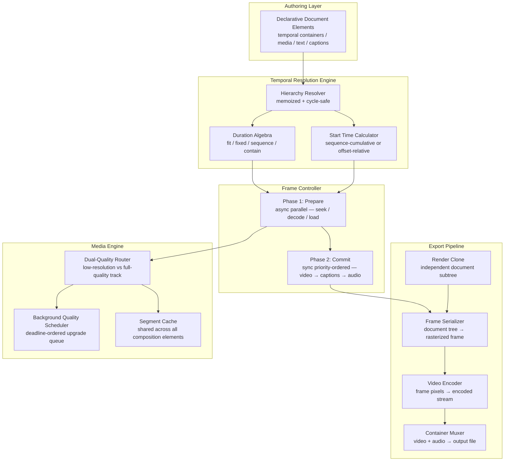
```mermaid
graph TD
    subgraph "Authoring Layer"
        A["Declarative Document Elements<br/>temporal containers / media / text / captions"]
    end

    subgraph "Temporal Resolution Engine"
        B["Hierarchy Resolver<br/>memoized + cycle-safe"]
        C["Duration Algebra<br/>fit / fixed / sequence / contain"]
        D["Start Time Calculator<br/>sequence-cumulative or offset-relative"]
    end

    subgraph "Frame Controller"
        E["Phase 1: Prepare<br/>async parallel — seek / decode / load"]
        F["Phase 2: Commit<br/>sync priority-ordered — video → captions → audio"]
    end

    subgraph "Export Pipeline"
        G["Render Clone<br/>independent document subtree"]
        H["Frame Serializer<br/>document tree → rasterized frame"]
        I["Video Encoder<br/>frame pixels → encoded stream"]
        J["Container Muxer<br/>video + audio → output file"]
    end

    subgraph "Media Engine"
        K["Dual-Quality Router<br/>low-resolution vs full-quality track"]
        L["Background Quality Scheduler<br/>deadline-ordered upgrade queue"]
        M["Segment Cache<br/>shared across all composition elements"]
    end

    A --> B
    B --> C
    B --> D
    C --> E
    D --> E
    E --> F
    F --> H
    G --> H
    H --> I
    I --> J
    E --> K
    K --> L
    K --> M
```

---

## Definitions

- **"Temporal element"** means any document element that participates in the temporal hierarchy, including but not limited to custom elements, standard document elements bearing temporal attributes, framework component instances, or any document node that implements the temporal element protocol described herein.

- **"Timegroup"** means a temporal container element that aggregates the durations of its child elements according to a composition mode to produce a composite duration. Timegroup includes any container operating under fit, fixed, sequence, or contain composition modes.

- **"Composition mode"** means a rule governing how a timegroup computes its own duration and assigns start times to its children. Composition modes include at minimum: (a) fit, wherein the timegroup duration equals the parent's duration; (b) fixed, wherein the timegroup has an author-specified duration regardless of child durations; (c) sequence, wherein the timegroup duration equals the sum of child durations minus any specified overlaps between adjacent children; (d) contain, wherein the timegroup duration equals the maximum of child durations accounting for per-child offset.

- **"Intrinsic duration"** means the media-native duration of an element, such as the encoded duration of a video or audio file, independent of any explicit duration specification by the author.

- **"Render clone"** means an independent copy of a document subtree that is isolated from the live document and used exclusively for frame-accurate export rendering without affecting the interactive preview.

- **"Frame controller"** means the subsystem that orchestrates all per-frame state changes across the document tree, including temporal visibility determination, animation position update, and media element seek.

- **"Scrub track"** means a low-resolution, high-seekability variant of a media source, optimized for fast random access at the cost of spatial fidelity.

- **"Fragment index"** means a data structure that maps each encoded segment of a media file to its position within the file, duration, and codec parameters, enabling random access to arbitrary time positions without reading the complete file.

- **"Processor"** means a central processing unit (CPU), graphics processing unit (GPU), digital signal processor (DSP), application-specific integrated circuit (ASIC), field-programmable gate array (FPGA), browser JavaScript engine, WebAssembly runtime, Web Worker, Service Worker, distributed compute cluster, or any combination thereof capable of executing instructions.

- **"Temporal hierarchy"** means a directed acyclic graph of temporal elements where each non-root element has exactly one parent temporal element and the root element has no parent. Temporal hierarchy includes flat single-level hierarchies with exactly one root and zero or more leaf children.

- **"Animation"** means any time-varying visual property of a document element, expressed via declarative animation specifications, the Web Animations API, CSS keyframes, or equivalent mechanism.

- **"Media segment"** means a self-contained unit of encoded audio or video data corresponding to a contiguous time range within a media source. Media segment includes any equivalent unit in MP4, HLS, DASH, WebM, or other container formats.

---

## System Architecture

### 1. Temporal Compositional Algebra (Primary Invention)

The temporal compositional algebra is the primary invention of this disclosure. It is a set of four composition rules — fit, fixed, sequence, contain — applied to nodes in a hierarchical document element tree, which together constitute a complete algebra for expressing any temporal relationship between composition elements. The algebra is described in detail in the Temporal Hierarchy Resolution Engine section immediately following the element type catalog.

### 2. Temporal Element Layer

The system defines a family of document element types organized into two functional roles: **temporal containers** and **temporal leaves**. Both roles participate in a uniform temporal element protocol through a shared behavioral mixin. The taxonomy below describes functional roles; any number of concrete element types may implement each role.

**Temporal containers** aggregate the durations of their children according to a composition mode and assign start times to those children. A composition context element provides ambient configuration — such as media engine mode and service endpoints — to all descendant temporal elements without itself contributing duration.

**Temporal leaf elements** are the terminal nodes of the hierarchy. Each leaf is associated with one content type; its duration is determined by the content type and any author-specified trim or duration attributes. Content types include, but are not limited to:

- **Continuous time-based media** — content whose duration is defined by an encoded media stream (video, audio, or combined audio/video). Accepts a source reference, optional trim points defining a sub-range of the source, and an optional low-resolution seek variant for interactive scrubbing.

- **Static visual content** — content with no intrinsic duration, such as still images or vector graphics. Duration is inherited from the parent container or specified explicitly.

- **Synthesized visual content** — content rendered by the system at composition time, including styled text, data-driven visualizations, and any other content whose visual output is computed rather than decoded from an external source.

- **Time-synchronized annotation content** — content whose visual output is driven by a time-indexed data source, such as caption or subtitle data, where each entry is active during a defined time range and the displayed output changes discretely at entry boundaries. Accepts the data inline, by reference to an external source, or by reference to a transcription service.

- **Signal visualization content** — content whose visual output is derived from real-time analysis of an associated media stream, such as a frequency-domain visualization of audio data.

Any document element that implements the temporal element protocol — exposing start time, duration, end time, local time, a phase state, and the three-method frame rendering protocol — qualifies as a temporal element regardless of its concrete type, name, or implementation mechanism.

All element types expose a uniform three-method frame rendering protocol: a synchronous readiness query, an asynchronous preparation phase that may perform network or decode operations, and a synchronous commit phase that writes visual state to the document.

#### Figure 2 — Temporal Element Role Hierarchy

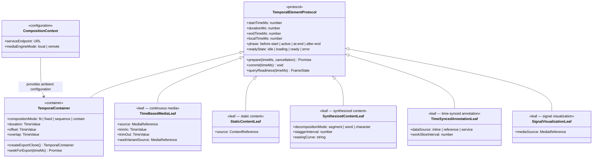
```mermaid
classDiagram
    class TemporalElementProtocol {
        <<protocol>>
        +startTimeMs: number
        +durationMs: number
        +endTimeMs: number
        +localTimeMs: number
        +phase: before-start | active | at-end | after-end
        +readyState: idle | loading | ready | error
        +prepare(timeMs, cancellation) Promise
        +commit(timeMs) void
        +queryReadiness(timeMs) FrameState
    }

    class CompositionContext {
        <<configuration>>
        +serviceEndpoint: URL
        +mediaEngineMode: local | remote
    }

    class TemporalContainer {
        <<container>>
        +compositionMode: fit | fixed | sequence | contain
        +duration: TimeValue
        +offset: TimeValue
        +overlap: TimeValue
        +createExportClone() TemporalContainer
        +seekForExport(timeMs) Promise
    }

    class TimeBasedMediaLeaf {
        <<leaf — continuous media>>
        +source: MediaReference
        +trimIn: TimeValue
        +trimOut: TimeValue
        +seekVariantSource: MediaReference
    }

    class StaticContentLeaf {
        <<leaf — static content>>
        +source: ContentReference
    }

    class SynthesizedContentLeaf {
        <<leaf — synthesized content>>
        +decompositionMode: segment | word | character
        +staggerInterval: number
        +easingCurve: string
    }

    class TimeSyncedAnnotationLeaf {
        <<leaf — time-synced annotation>>
        +dataSource: inline | reference | service
        +workSliceInterval: number
    }

    class SignalVisualizationLeaf {
        <<leaf — signal visualization>>
        +mediaSource: MediaReference
    }

    TemporalElementProtocol <|-- TemporalContainer
    TemporalElementProtocol <|-- TimeBasedMediaLeaf
    TemporalElementProtocol <|-- StaticContentLeaf
    TemporalElementProtocol <|-- SynthesizedContentLeaf
    TemporalElementProtocol <|-- TimeSyncedAnnotationLeaf
    TemporalElementProtocol <|-- SignalVisualizationLeaf
    CompositionContext --> TemporalContainer : provides ambient configuration
```

---

### 3. Temporal Hierarchy Resolution Engine

The temporal hierarchy resolution engine computes three properties for each temporal element: start time, duration, and end time. These properties are computed lazily on demand, memoized per render cycle, and invalidated at the start of each new cycle. The engine prevents infinite recursion caused by circular temporal dependencies by tracking which elements are currently under computation and returning a safe fallback value when a cycle is detected.

#### Figure 3 — Duration Resolution with Cycle Detection

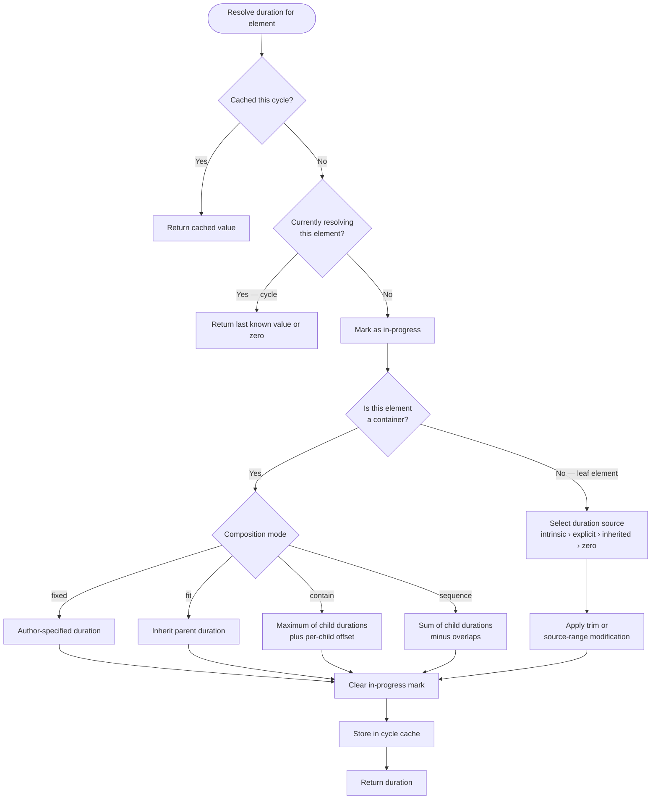
```mermaid
flowchart TD
    A([Resolve duration for element]) --> B{Cached this cycle?}
    B -->|Yes| C[Return cached value]
    B -->|No| D{Currently resolving<br/>this element?}
    D -->|Yes — cycle| E[Return last known value or zero]
    D -->|No| F[Mark as in-progress]
    F --> G{Is this element<br/>a container?}
    G -->|Yes| H{Composition mode}
    H -->|fixed| I[Author-specified duration]
    H -->|fit| J[Inherit parent duration]
    H -->|contain| K[Maximum of child durations<br/>plus per-child offset]
    H -->|sequence| L[Sum of child durations<br/>minus overlaps]
    G -->|No — leaf element| M[Select duration source<br/>intrinsic › explicit › inherited › zero]
    M --> N[Apply trim or<br/>source-range modification]
    I --> O[Clear in-progress mark]
    J --> O
    K --> O
    L --> O
    N --> O
    O --> P[Store in cycle cache]
    P --> Q[Return duration]
```

**Duration computation rules** for a timegroup with children C₀…Cₙ and composition mode M:

| Mode | Rule |
|------|------|
| `fixed` | Duration equals the author-specified value, independent of children |
| `fit` | Duration equals the parent container's duration |
| `contain` | Duration equals the maximum of each child's duration plus its offset |
| `sequence` | Duration equals the sum of child durations minus the sum of pairwise overlaps |

Each child's duration is resolved recursively before the parent's computation proceeds. Start times are derived from durations: in sequence mode, each child's start time equals the cumulative duration of all preceding siblings minus their overlaps; in all other modes, each child's start time equals the parent's start time plus an optional per-child offset attribute.

Duration for leaf elements is resolved from the following sources in priority order: (1) intrinsic media duration, (2) explicit author-specified duration, (3) inherited parent duration, (4) zero. After source selection, trim modifiers reduce the duration by the specified trim-in and trim-out amounts, and source range modifiers substitute the difference between specified source-out and source-in points.

#### Figure 4 — Composition Mode Behavior on a Four-Child Timeline

```mermaid
gantt
    dateFormat  x
    axisFormat  %Ls

    section sequence mode
    Child A (5s)    :a, 0, 5000
    Child B (3s)    :b, 5000, 8000
    Child C (4s)    :c, 8000, 12000
    Child D (2s)    :d, 12000, 14000

    section contain mode (all at offset 0)
    Child A (5s)    :a2, 0, 5000
    Child B (3s)    :b2, 0, 3000
    Child C (4s)    :c2, 0, 4000
    Child D (2s)    :d2, 0, 2000

    section sequence with 1s overlap
    Child A (5s)    :a3, 0, 5000
    Child B (3s)    :b3, 4000, 7000
    Child C (4s)    :c3, 6000, 10000
    Child D (2s)    :d3, 9000, 11000
```

---

### 4. Frame Controller

The frame controller is a document-level singleton that orchestrates all per-frame visual state changes for both interactive playback and export rendering. It operates in two strictly ordered phases per frame.

#### Figure 5 — Two-Phase Frame Controller

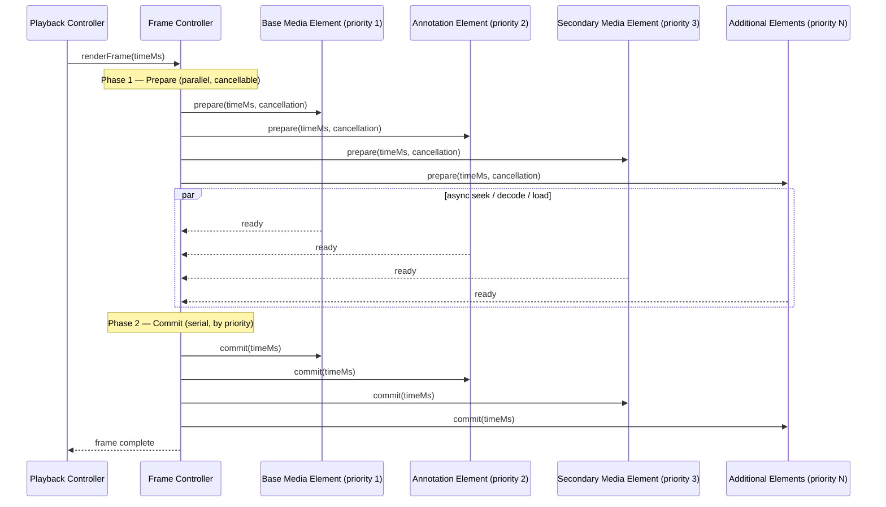
```mermaid
sequenceDiagram
    participant PC as Playback Controller
    participant FC as Frame Controller
    participant E1 as Base Media Element (priority 1)
    participant E2 as Annotation Element (priority 2)
    participant E3 as Secondary Media Element (priority 3)
    participant EN as Additional Elements (priority N)

    PC->>FC: renderFrame(timeMs)
    note over FC: Phase 1 — Prepare (parallel, cancellable)
    FC->>E1: prepare(timeMs, cancellation)
    FC->>E2: prepare(timeMs, cancellation)
    FC->>E3: prepare(timeMs, cancellation)
    FC->>EN: prepare(timeMs, cancellation)
    par async seek / decode / load
        E1-->>FC: ready
        E2-->>FC: ready
        E3-->>FC: ready
        EN-->>FC: ready
    end
    note over FC: Phase 2 — Commit (serial, by priority)
    FC->>E1: commit(timeMs)
    FC->>E2: commit(timeMs)
    FC->>E3: commit(timeMs)
    FC->>EN: commit(timeMs)
    FC-->>PC: frame complete
```

**Phase 1 — Prepare** (asynchronous, parallel): The controller iterates all registered temporal elements. Elements whose temporal window does not contain the target time are marked invisible and skipped. For each visible element, the controller invokes the element's asynchronous preparation method, passing the target time and a cancellation token. All preparation calls proceed concurrently. If a superseding frame request arrives, the cancellation token signals all in-flight preparations to abort.

**Phase 2 — Commit** (synchronous, priority-ordered): After all preparations complete, the controller iterates registered elements in ascending priority order, invoking each element's synchronous commit method. Priority is assigned so that base media content is committed before annotation overlays, which are committed before derived signal visualizations, guaranteeing consistent visual state at the moment of capture. The priority ordering is author-configurable; the system assigns default priorities based on the functional role of each element.

---

### 5. Frame Serialization Pipeline

The serialization system converts the live document tree to a rasterized image at each frame position for encoding into the output video.

#### Figure 6 — Frame Serialization Pipeline

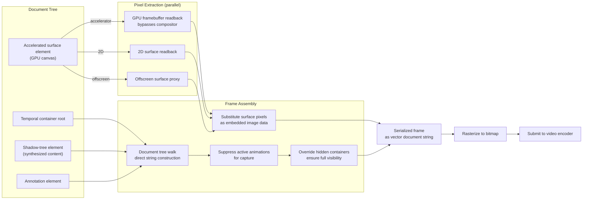
```mermaid
flowchart LR
    subgraph "Document Tree"
        A[Temporal container root]
        B["Accelerated surface element<br/>(GPU canvas)"]
        C["Shadow-tree element<br/>(synthesized content)"]
        D[Annotation element]
    end

    subgraph "Pixel Extraction (parallel)"
        E["GPU framebuffer readback<br/>bypasses compositor"]
        F["2D surface readback"]
        G["Offscreen surface proxy"]
    end

    subgraph "Frame Assembly"
        H["Document tree walk<br/>direct string construction"]
        I["Substitute surface pixels<br/>as embedded image data"]
        J["Suppress active animations<br/>for capture"]
        K["Override hidden containers<br/>ensure full visibility"]
    end

    L[Serialized frame<br/>as vector document string]
    M[Rasterize to bitmap]
    N[Submit to video encoder]

    B -->|accelerator| E
    B -->|2D| F
    B -->|offscreen| G
    A --> H
    C --> H
    D --> H
    E --> I
    F --> I
    G --> I
    H --> J
    J --> K
    I --> L
    K --> L
    L --> M
    M --> N
```

The serializer walks the document tree synchronously, building a vector document string via direct string construction rather than using the platform's built-in serialization API. Shadow subtrees are traversed recursively; slot elements are resolved to their assigned content. Accelerated canvas elements — which cannot appear inside a vector document frame — are read back to pixel data and substituted as embedded bitmap data. For hardware-accelerated canvases, pixel data is read directly from the GPU framebuffer rather than through the compositor, which enables correct capture when the document is not the foreground window. Active animations are suppressed at capture time so that the serialized frame reflects the frame controller's explicitly committed state rather than wall-clock animation progress. Containers marked hidden for off-screen use are forced visible to ensure that composition content is captured regardless of its position in the document.

All canvas pixel captures are initiated concurrently. The document tree walk proceeds synchronously. Final assembly waits for all pixel captures before completing.

---

### 6. Overlapped Export Pipeline

The export pipeline produces a video file from a render clone by driving it through a seek-serialize-encode cycle at the target output frame rate. A lookahead mechanism overlaps the seek latency of frame N+1 with the serialization and encoding of frame N, maximizing pipeline throughput.

#### Figure 7 — Overlapped Export Pipeline (2-Frame Lookahead)

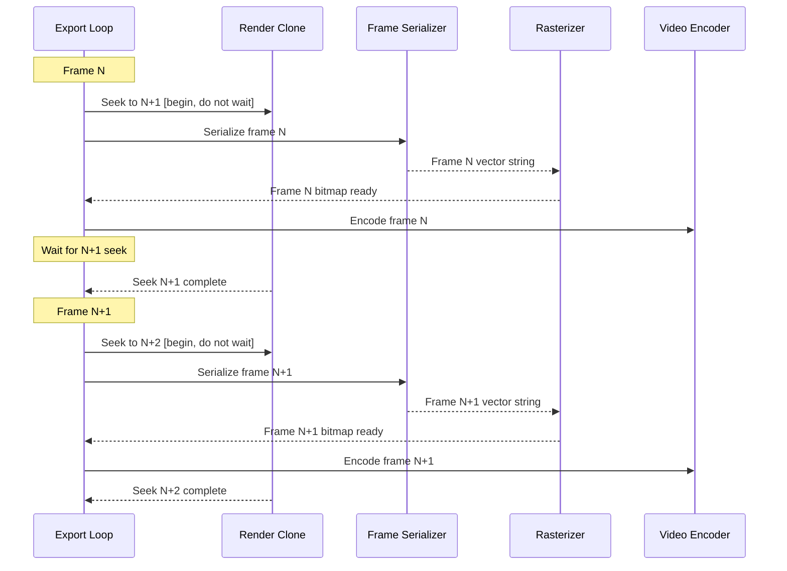
```mermaid
sequenceDiagram
    participant L as Export Loop
    participant C as Render Clone
    participant S as Frame Serializer
    participant R as Rasterizer
    participant E as Video Encoder

    note over L: Frame N

    L->>C: Seek to N+1 [begin, do not wait]
    L->>S: Serialize frame N
    S-->>R: Frame N vector string
    R-->>L: Frame N bitmap ready
    L->>E: Encode frame N

    note over L: Wait for N+1 seek
    C-->>L: Seek N+1 complete

    note over L: Frame N+1

    L->>C: Seek to N+2 [begin, do not wait]
    L->>S: Serialize frame N+1
    S-->>R: Frame N+1 vector string
    R-->>L: Frame N+1 bitmap ready
    L->>E: Encode frame N+1
    C-->>L: Seek N+2 complete
```

Audio is rendered concurrently in fixed-duration chunks, each decoded from the media sources at the corresponding source time offsets and submitted to an audio encoder. When all video frames and audio chunks have been encoded, the encoder outputs are assembled into a single output container and written either to a user-selected file location using direct filesystem access, or accumulated in memory for programmatic consumption.

---

### 7. Render Clone System

The render clone system produces an independent copy of the live document tree for use in export rendering, without disrupting the interactive preview state of the original tree.

#### Consistency Model

The render clone system maintains the following **consistency invariant**: for any composition whose tree structure, element attributes, and media source content are held constant between clone creation and export completion, the pixel output produced by the export pipeline at any timeline position T is equal to the pixel output that the interactive preview would produce when committed to position T.

Formally, the invariant has two conditions:

1. **Structural consistency** — the clone's element tree is a complete copy of the live tree at the moment of clone creation. Mutations to the live tree after clone creation (attribute changes, element insertion or removal) do not affect the clone. The clone's exported output reflects the tree state at clone creation time.

2. **Temporal consistency** — the clone's export pipeline drives each element to position T using the same phase-state machine and the same animation progress computation as the interactive preview's frame controller. Given identical element state at position T, both pipelines produce identical visual output.

The invariant is not maintained under the following conditions, which are documented as known exceptions rather than design-arounds:

- **Non-deterministic media decode** — if the platform's video decoder produces different output for the same encoded bytes on repeated decode operations (a property of some hardware accelerators), pixel-level equality is not guaranteed. Perceptual equivalence is maintained.
- **System font substitution** — if a specified font is not available in the export rendering environment and a different fallback font is substituted, text layout and pixel output may differ. The system provides a font loading mechanism to mitigate this; font absence is a configuration error, not an invariant violation.
- **Time-of-mutation concurrent edits** — if the live tree is mutated concurrently with clone creation (a race condition in multi-threaded or async authoring contexts), the clone may capture a partially-mutated tree. This is a caller responsibility, not a system limitation.

#### Figure 8 — Render Clone Creation

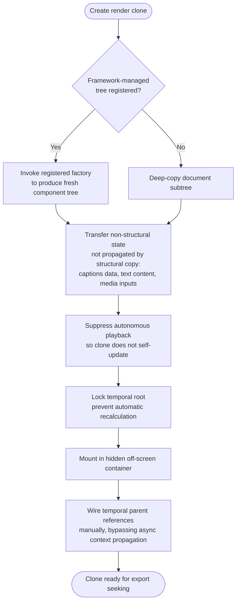
```mermaid
flowchart TD
    A([Create render clone]) --> B{Framework-managed<br/>tree registered?}
    B -->|Yes| C[Invoke registered factory<br/>to produce fresh component tree]
    B -->|No| D[Deep-copy document subtree]
    C --> E[Transfer non-structural state<br/>not propagated by structural copy:<br/>captions data, text content, media inputs]
    D --> E
    E --> F[Suppress autonomous playback<br/>so clone does not self-update]
    F --> G[Lock temporal root<br/>prevent automatic recalculation]
    G --> H[Mount in hidden off-screen container]
    H --> I[Wire temporal parent references<br/>manually, bypassing async context propagation]
    I --> J([Clone ready for export seeking])
```

When the document tree is managed by a component framework, direct structural copying does not produce a usable clone because framework-managed DOM does not transfer the component lifecycle that drives rendering. For these cases, a factory registry allows framework components to register a function that produces a fresh, correctly initialized component tree on demand. For plain document trees, a structural deep copy suffices. After copying, state that is held as JavaScript object properties rather than document attributes — including media inputs, caption data objects, and text segment content — must be explicitly transferred to the clone. The clone is then configured to suppress autonomous re-renders and temporal root recalculation, mounted off-screen, and its temporal parent relationships are wired synchronously. The synchronous wiring step is required because the asynchronous context propagation mechanism used in the live document cannot be relied upon during the programmatic mounting sequence used for clones.

---

### 8. Animation Scrubbing System

The animation scrubbing system maps all animations associated with a temporal element to an arbitrary timeline position, enabling frame-accurate non-linear navigation and export at any frame rate.

#### Figure 9 — Animation Scrubbing Phase State Machine

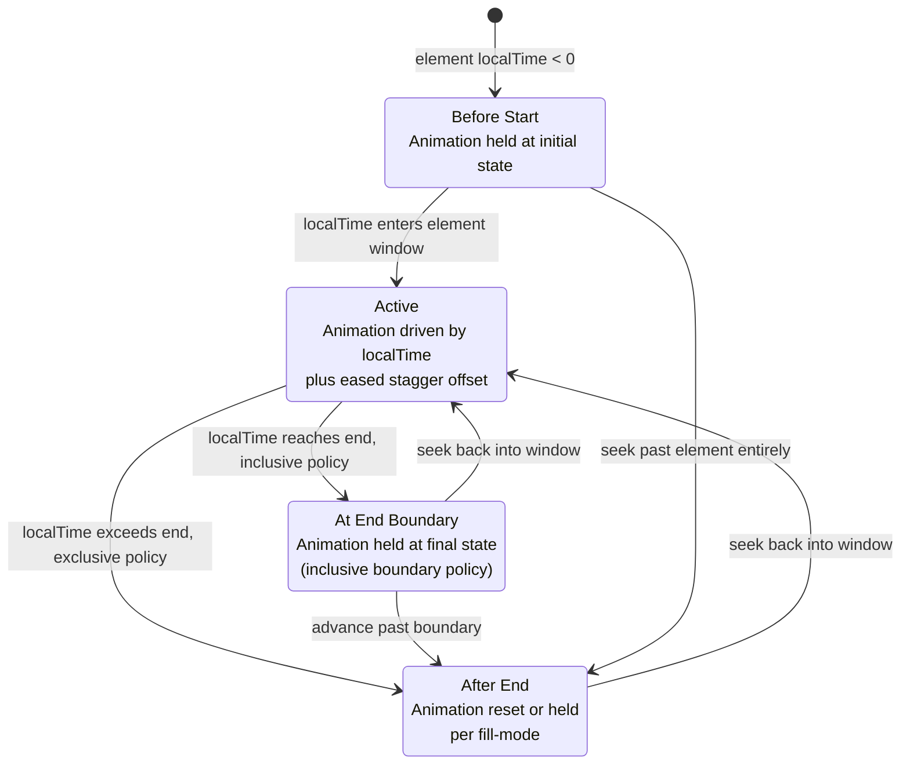
```mermaid
stateDiagram-v2
    [*] --> BeforeStart : element localTime < 0

    BeforeStart : Before Start<br/>Animation held at initial state
    Active : Active<br/>Animation driven by localTime<br/>plus eased stagger offset
    AtEndBoundary : At End Boundary<br/>Animation held at final state<br/>(inclusive boundary policy)
    AfterEnd : After End<br/>Animation reset or held<br/>per fill-mode

    BeforeStart --> Active : localTime enters element window
    Active --> AtEndBoundary : localTime reaches end, inclusive policy
    Active --> AfterEnd : localTime exceeds end, exclusive policy
    AtEndBoundary --> Active : seek back into window
    AtEndBoundary --> AfterEnd : advance past boundary
    AfterEnd --> Active : seek back into window
    BeforeStart --> AfterEnd : seek past element entirely
```

For each temporal element at a given timeline position, the scrubbing system first determines the element's local time — the timeline position relative to the element's start time. The element's phase is then determined: before-start if local time is negative, after-end if local time exceeds the element's duration, and active otherwise.

For each animation associated with the element, the animation is paused and its progress is set directly to the value corresponding to the element's current phase and local time. Before-start: progress is held just before the initial state to prevent the animation from entering a finished condition. After-end: progress is set to the initial or final state according to the animation's fill-mode specification. Active: progress is computed from local time adjusted by a per-segment stagger offset and the animation's own delay, then mapped through the animation's direction (forward, reverse, or alternating) to produce the correct position within the animation's iteration cycle.

Animations that have previously reached their natural end are retained in a weak reference store, because the platform's animation API removes finished animations from its active enumeration. The weak reference store allows the scrubbing system to re-address these animations when seeking to positions within their active window.

A sub-millisecond guard offset prevents animations from entering the finished state when their progress is set to the nominal end value, which would cause them to be removed from the active enumeration prematurely.

---

### 9. Dual-Quality Media Seeking System

The media seeking system routes each seek request to one of two quality tiers — a low-resolution scrub track optimized for seek speed, or a full-quality main track — based on cache state, and upgrades to full quality in the background.

#### Figure 10 — Dual-Quality Seek Routing

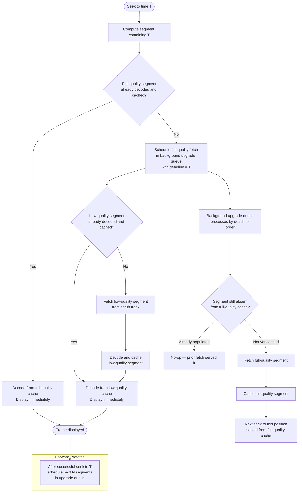
```mermaid
flowchart TD
    A([Seek to time T]) --> B[Compute segment containing T]
    B --> C{Full-quality segment<br/>already decoded and cached?}

    C -->|Yes| D[Decode from full-quality cache<br/>Display immediately]
    D --> Z([Frame displayed])

    C -->|No| E[Schedule full-quality fetch<br/>in background upgrade queue<br/>with deadline = T]
    E --> F{Low-quality segment<br/>already decoded and cached?}

    F -->|Yes| G[Decode from low-quality cache<br/>Display immediately]
    G --> Z

    F -->|No| H[Fetch low-quality segment<br/>from scrub track]
    H --> I[Decode and cache<br/>low-quality segment]
    I --> G

    E --> K[Background upgrade queue<br/>processes by deadline order]
    K --> L{Segment still absent<br/>from full-quality cache?}
    L -->|Already populated| M[No-op — prior fetch served it]
    L -->|Not yet cached| N[Fetch full-quality segment]
    N --> O[Cache full-quality segment]
    O --> P[Next seek to this position<br/>served from full-quality cache]

    subgraph "Forward Prefetch"
        Q[After successful seek to T<br/>schedule next N segments<br/>in upgrade queue]
    end

    Z --> Q
```

On each seek, the system first queries a process-wide cache keyed by source URL, segment identifier, and quality tier. A full-quality cache hit bypasses the scrub track entirely. On a miss, the scrub track is used for immediate low-latency display while a background scheduler enqueues a full-quality fetch with a deadline equal to the seek position. The scheduler processes its queue in deadline order, ensuring that the most recently visited positions are upgraded first. Fetches that are already in-flight are never cancelled — they will populate the shared cache regardless of subsequent seeks, benefiting any future access to the same segment. After a successful seek, the system proactively enqueues the next several forward segments in the background scheduler, reducing latency for sequential playback.

Concurrent seeks to the same segment are serialized: if a fetch for a given segment is already in progress, subsequent seek requests for the same segment attach to the existing fetch rather than issuing duplicate requests.

---

### 10. Media Segment Transport and Indexing

The system separates segment transport, segment indexing, and timestamp normalization into independently interchangeable components, allowing different media hosting strategies to be composed without changing the seeking or decoding logic.

**Transport strategies:**
- **Byte-range transport** — the complete encoded track is fetched as a single binary resource; individual segments are extracted by reading the byte range specified in the fragment index.
- **URL-per-segment transport** — each segment has an independent URL; segments are fetched individually on demand.

**Index strategies:**
- **Pre-computed fragment index** — segment byte positions, sizes, and durations are computed once from the media file and stored. Gap handling: if the seek time falls between two segments, the nearest segment is selected.
- **Manifest index** — segment boundaries are derived at seek time from a manifest-provided list of segment durations, without pre-computation.

**Timestamp normalization strategies:**
- **Container-relative normalization** — sample timestamps are adjusted by subtracting the segment's composition offset, producing timestamps relative to the start of each segment.
- **Absolute normalization** — sample timestamps are used as-is, without adjustment.

#### Figure 11 — Streaming Fragment Index Generation

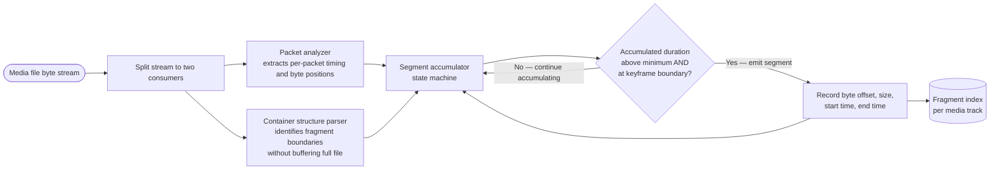
```mermaid
flowchart LR
    A([Media file byte stream]) --> B[Split stream to two consumers]
    B --> C[Packet analyzer<br/>extracts per-packet timing and byte positions]
    B --> D[Container structure parser<br/>identifies fragment boundaries<br/>without buffering full file]

    C --> E[Segment accumulator<br/>state machine]
    D --> E

    E --> F{Accumulated duration<br/>above minimum AND<br/>at keyframe boundary?}
    F -->|No — continue accumulating| E
    F -->|Yes — emit segment| G[Record byte offset, size,<br/>start time, end time]
    G --> E
    G --> H[(Fragment index<br/>per media track)]
```

The fragment index is generated by streaming the media file through two concurrent consumers: a packet analyzer that extracts per-packet timestamps and byte positions, and a container structure parser that identifies fragment boundaries by parsing container box headers without loading the file into memory. A segment accumulator state machine correlates these two streams, accumulating fragments until a minimum duration threshold is reached at a keyframe boundary, then emitting one index entry per segment. This approach enables index generation for files larger than available memory.

---

### 11. Adaptive Resolution System

The adaptive resolution system dynamically scales the composition render surface to maintain a target interactive frame rate, using two independent signals and a hysteresis mechanism to prevent scale oscillation.

#### Figure 12 — Adaptive Resolution State Machine

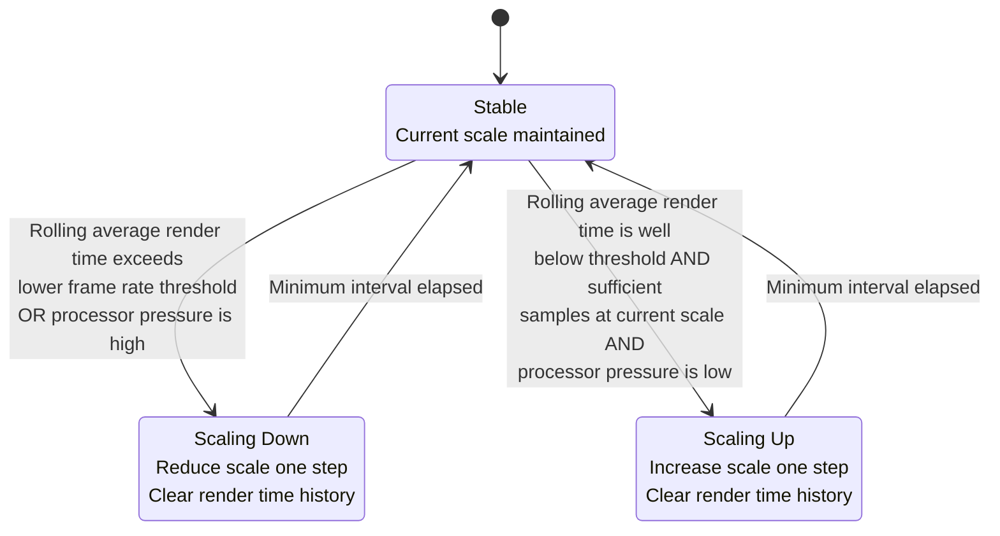
```mermaid
stateDiagram-v2
    [*] --> Stable

    Stable : Stable<br/>Current scale maintained
    ScalingDown : Scaling Down<br/>Reduce scale one step<br/>Clear render time history
    ScalingUp : Scaling Up<br/>Increase scale one step<br/>Clear render time history

    Stable --> ScalingDown : Rolling average render time exceeds<br/>lower frame rate threshold<br/>OR processor pressure is high
    Stable --> ScalingUp : Rolling average render time is well<br/>below threshold AND sufficient<br/>samples at current scale AND<br/>processor pressure is low
    ScalingDown --> Stable : Minimum interval elapsed
    ScalingUp --> Stable : Minimum interval elapsed
```

**Reactive signal** — a rolling window of recent render durations is maintained. If the average exceeds a lower-frame-rate threshold, the scale is reduced by one step. If the average is well below the threshold and a minimum number of samples have been collected at the current scale, the scale is increased by one step. The asymmetric thresholds — a high threshold for scale-down and a much lower threshold for scale-up — create a stable band that prevents the system from oscillating between adjacent scale steps.

**Proactive signal** — a processor pressure observer provides advance notice of resource contention before render times degrade. High or critical pressure levels trigger an immediate scale-down without waiting for render times to deteriorate.

The scale is selected from a fixed discrete ladder of values, spaced at uniform percentage intervals. A minimum interval between consecutive scale changes prevents rapid successive adjustments. The render time history is cleared on every scale change, so that measurements from the prior scale do not influence decisions at the new scale. The system may be initialized at any step on the ladder, enabling warm-start operation after a viewport resize or device rotation.

---

### 12. Caption Loading and Rendering System

#### Figure 13 — Annotation Data Source Priority Chain

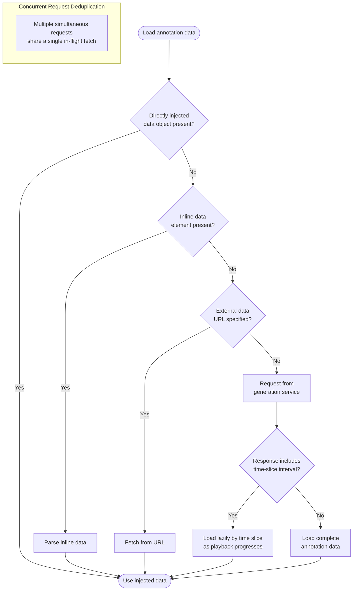
```mermaid
flowchart TD
    A([Load annotation data]) --> B{Directly injected<br/>data object present?}
    B -->|Yes| Z([Use injected data])
    B -->|No| C{Inline data<br/>element present?}
    C -->|Yes| D[Parse inline data]
    D --> Z
    C -->|No| E{External data<br/>URL specified?}
    E -->|Yes| F[Fetch from URL]
    F --> Z
    E -->|No| H[Request from<br/>generation service]
    H --> I{Response includes<br/>time-slice interval?}
    I -->|Yes| J[Load lazily by time slice<br/>as playback progresses]
    I -->|No| K[Load complete<br/>annotation data]
    J --> Z
    K --> Z

    subgraph "Concurrent Request Deduplication"
        L[Multiple simultaneous requests<br/>share a single in-flight fetch]
    end
```

Annotation data is resolved from four sources in priority order: directly injected data objects, inline data embedded in a child document element, an external data URL, and a generation service that produces time-indexed annotation data from media content. In-flight requests are deduplicated so that concurrent callers share a single network operation.

For server-generated annotation data structured as time-sliced work units, the system loads only the slice containing the current playback position, enabling lazy loading without fetching the complete dataset upfront.

At each frame, the active entry is identified by scanning the time-indexed annotation data for the entry whose time window contains the current position. The annotation element exposes sub-elements for the active entry, preceding entries in the current segment, following entries, and the complete current segment text, enabling rich animated styling via standard CSS applied to these sub-elements.

The annotation element intercepts temporal visibility signals that would otherwise hide it from the document layout. Rather than fully removing it from layout, the element substitutes a visibility-preserving equivalent, because inner sub-elements manage their own visibility and require the parent to remain in flow.

---

### 13. Text Decomposition and Stagger System

#### Figure 14 — Text Decomposition and Eased Stagger

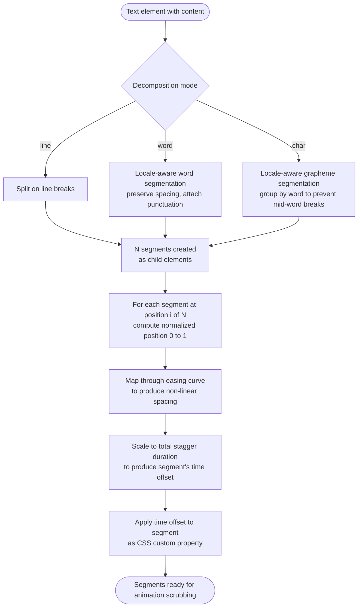
```mermaid
flowchart TD
    A([Text element with content]) --> B{Decomposition mode}

    B -->|line| C[Split on line breaks]
    B -->|word| D[Locale-aware word segmentation<br/>preserve spacing, attach punctuation]
    B -->|char| E[Locale-aware grapheme segmentation<br/>group by word to prevent mid-word breaks]

    C --> H[N segments created<br/>as child elements]
    D --> H
    E --> H

    H --> I[For each segment at position i of N<br/>compute normalized position 0 to 1]
    I --> J[Map through easing curve<br/>to produce non-linear spacing]
    J --> K[Scale to total stagger duration<br/>to produce segment's time offset]
    K --> L[Apply time offset to segment<br/>as CSS custom property]
    L --> M([Segments ready for animation scrubbing])
```

Text content is decomposed into animated sub-elements at one of three granularities: lines, words, or grapheme clusters (individual user-perceived characters). Word decomposition uses a locale-aware segmenter that correctly handles Unicode word boundaries, preserves whitespace segments to maintain layout, and attaches trailing punctuation to the preceding word. Grapheme cluster decomposition correctly handles multi-codepoint sequences such as emoji, combined diacritics, and CJK composed characters as single atomic units, and groups characters within the same word to prevent line breaks at mid-word positions.

Each sub-element receives a temporal stagger offset that delays the start of its animation relative to the element's start time. Stagger offsets are computed by mapping the sub-element's normalized position within the sequence (0 for first, 1 for last) through an easing curve, then scaling the result to the total stagger duration. This produces non-linear temporal spacing — for example, an ease-in curve causes later sub-elements to have proportionally larger offsets, accelerating the entrance of words across the sequence. The easing curve is evaluated by numerically inverting the parametric cubic Bézier form via binary search.

The stagger offset is delivered as a CSS custom property on each sub-element, consumed by the animation scrubbing system when computing per-sub-element animation progress.

---

### 14. Temporal State Propagation

The system propagates changes to the root timeline position to all descendant temporal elements without incurring scheduling latency.

#### Figure 15 — Microtask-Based Time Propagation

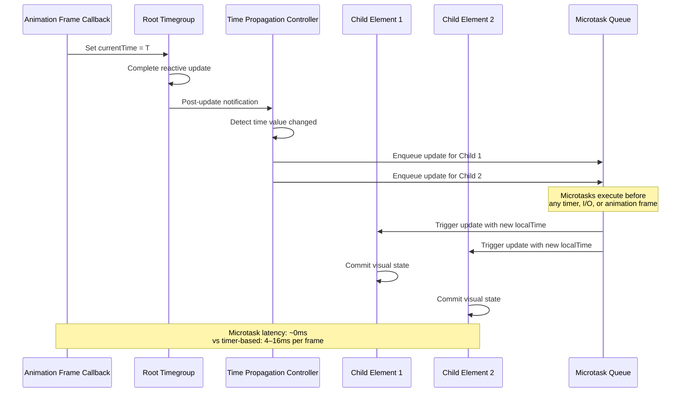
```mermaid
sequenceDiagram
    participant RAF as Animation Frame Callback
    participant Root as Root Timegroup
    participant Ctrl as Time Propagation Controller
    participant C1 as Child Element 1
    participant C2 as Child Element 2
    participant MQ as Microtask Queue

    RAF->>Root: Set currentTime = T
    Root->>Root: Complete reactive update
    Root->>Ctrl: Post-update notification
    Ctrl->>Ctrl: Detect time value changed
    Ctrl->>MQ: Enqueue update for Child 1
    Ctrl->>MQ: Enqueue update for Child 2
    note over MQ: Microtasks execute before<br/>any timer, I/O, or animation frame
    MQ->>C1: Trigger update with new localTime
    MQ->>C2: Trigger update with new localTime
    C1->>C1: Commit visual state
    C2->>C2: Commit visual state

    note over RAF,C2: Microtask latency: ~0ms<br/>vs timer-based: 4–16ms per frame
```

When the root timegroup's current position changes, a propagation controller attached to the root detects the change in its post-update callback and enqueues an update notification for each descendant child using the platform's microtask queue. Microtasks execute before the next timer callback, I/O callback, or animation frame, eliminating the 4–16 milliseconds of dead time that a timer-based approach would introduce. In a 30fps render pipeline with a 33ms frame budget, this latency difference is significant.

The propagation controller suppresses notifications when the time value has not changed, preventing cascading updates triggered by unrelated property changes on the root element.

At the time an element connects to the document, its role as root or child must be determined synchronously. The asynchronous context propagation mechanism used to distribute parent references cannot be relied upon during the initial connection sequence, because a child element may complete its first update before its parent has propagated its context. The system therefore queries the document structure directly at connection time to determine ancestral relationships.

---

## Data Model

#### Figure 16 — Core Data Model Relationships

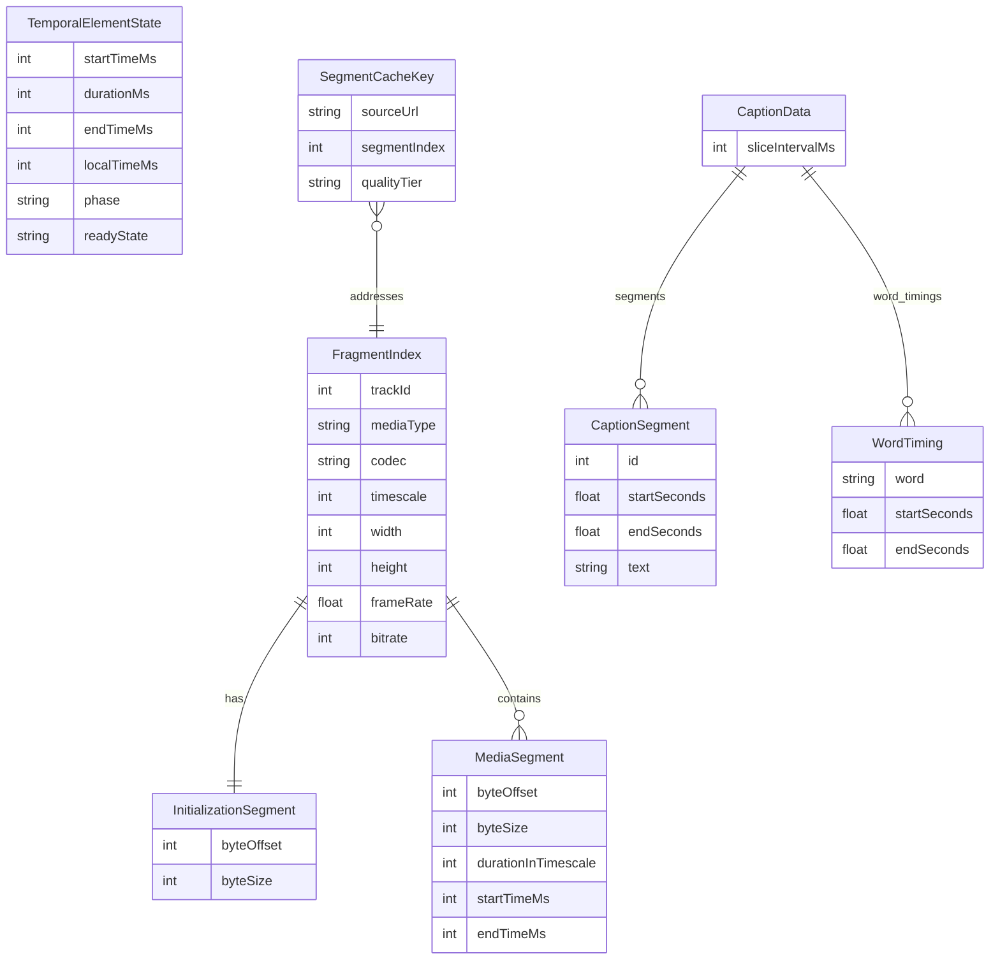
```mermaid
erDiagram
    FragmentIndex {
        int trackId
        string mediaType
        string codec
        int timescale
        int width
        int height
        float frameRate
        int bitrate
    }

    InitializationSegment {
        int byteOffset
        int byteSize
    }

    MediaSegment {
        int byteOffset
        int byteSize
        int durationInTimescale
        int startTimeMs
        int endTimeMs
    }

    TemporalElementState {
        int startTimeMs
        int durationMs
        int endTimeMs
        int localTimeMs
        string phase
        string readyState
    }

    SegmentCacheKey {
        string sourceUrl
        int segmentIndex
        string qualityTier
    }

    CaptionData {
        int sliceIntervalMs
    }

    CaptionSegment {
        int id
        float startSeconds
        float endSeconds
        string text
    }

    WordTiming {
        string word
        float startSeconds
        float endSeconds
    }

    FragmentIndex ||--|| InitializationSegment : has
    FragmentIndex ||--o{ MediaSegment : contains
    CaptionData ||--o{ CaptionSegment : segments
    CaptionData ||--o{ WordTiming : word_timings
    SegmentCacheKey }o--|| FragmentIndex : addresses
```

**Fragment index** — maps each encoded segment of a media track to its byte position, duration, and codec parameters. Tracks within the same file are indexed independently by track identifier. The initialization segment, which carries codec configuration, is indexed separately from media segments.

**Temporal element state** — the resolved temporal properties for a single element at a given render cycle: start time, duration, end time, local time (timeline position relative to element start), current phase, and content ready state.

**Segment cache key** — the composite key used to look up decoded media segments in the shared cache: source URL, zero-based segment index, and quality tier identifier.

**Caption data** — the complete caption dataset for a captions element, comprising segment-level text entries with time ranges and word-level entries with per-word time ranges. An optional slice interval indicates that the data was generated in time-sliced chunks and may be loaded lazily.

---

## Operational Flows

### Flow 1 — Interactive Playback Seek

The user moves the timeline playhead to position T.

1. The playback controller cancels any pending seek and sets the root timegroup's current position to T.
2. The time propagation controller detects the change and enqueues update notifications for all descendant elements via the microtask queue.
3. Children receive their updated local time and complete their reactive updates.
4. The frame controller initiates concurrent preparation across all temporally visible elements: time-based media elements seek to the target position, annotation elements identify the active entry for that position, and signal visualization elements compute derived display data.
5. After all preparations complete, the frame controller commits visual state in priority order: video frames, then caption overlays, then audio visualizations.
6. The document now displays the accurate visual state for position T.

### Flow 2 — Video Export

The author requests export of the composition to a video file.

1. A render clone is created from the live document tree and mounted off-screen.
2. A video encoder is initialized with the target output parameters.
3. For each output frame at time T: the clone begins seeking to the next frame's position in the background, while the current frame is serialized, rasterized, and submitted to the encoder. The pipeline waits for the background seek to complete before advancing to the next frame.
4. Audio is decoded in fixed-duration chunks from the media sources and submitted to an audio encoder concurrently with video frame processing.
5. After all frames and audio chunks are encoded, the outputs are assembled into an output container and written to the target destination.

### Flow 3 — Media Segment Request

A client requests a specific media segment for a given rendition and time position.

1. The request is parsed to extract the rendition identifier and segment number.
2. The fragment index for the source file is retrieved from cache, or generated by streaming the file through the index generation pipeline.
3. The track identifier corresponding to the requested rendition is looked up in the fragment index.
4. The segment's byte offset and size are retrieved from the fragment index entry for the requested segment number.
5. The byte range is read from the source file and streamed to the client.

#### Figure 17 — Media Segment Request Dispatch

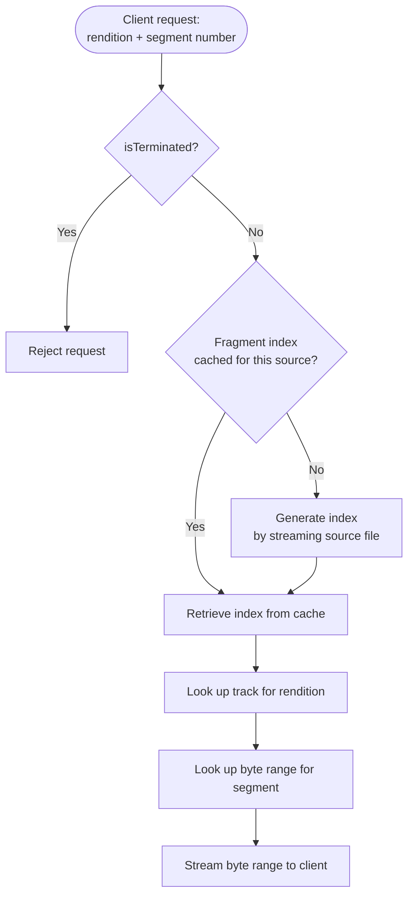
```mermaid
flowchart TD
    A(["Client request:<br/>rendition + segment number"]) --> B{isTerminated?}
    B -->|Yes| C[Reject request]
    B -->|No| D{Fragment index<br/>cached for this source?}
    D -->|Yes| E[Retrieve index from cache]
    D -->|No| F[Generate index<br/>by streaming source file]
    F --> E
    E --> G[Look up track for rendition]
    G --> H[Look up byte range for segment]
    H --> I[Stream byte range to client]
```

### Flow 4 — Scrub Track Generation

A low-resolution scrub track is generated from a source video on first access and cached for subsequent use.

1. A transcoder is launched to produce a low-resolution, fixed-frame-rate version of the source video.
2. The transcoder output is split to two concurrent consumers: the caller receives the encoded bytes as they are produced, and a fragment index is generated concurrently from the same byte stream.
3. The output stream to the caller is held open until both the transcoder finishes and the fragment index generation completes, ensuring the caller receives a complete, indexed output.
4. A sliding activity timeout detects stalled transcoding and terminates the operation with an error if no output is produced within a threshold interval.
5. The output file and index are cached under a deterministic filename derived from the source file. Subsequent requests for the same source skip transcoding entirely.

#### Figure 18 — Scrub Track Generation Stream Coordination

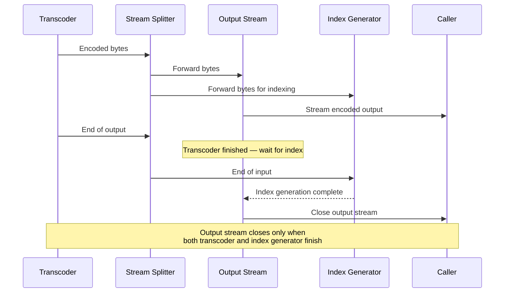
```mermaid
sequenceDiagram
    participant TC as Transcoder
    participant Tee as Stream Splitter
    participant Out as Output Stream
    participant Idx as Index Generator
    participant Cal as Caller

    TC->>Tee: Encoded bytes
    Tee->>Out: Forward bytes
    Tee->>Idx: Forward bytes for indexing

    Out->>Cal: Stream encoded output

    TC->>Tee: End of output
    note over Out: Transcoder finished — wait for index
    Tee->>Idx: End of input

    Idx-->>Out: Index generation complete

    Out->>Cal: Close output stream

    note over TC,Cal: Output stream closes only when<br/>both transcoder and index generator finish
```

### Flow 5 — Animated Text at an Arbitrary Timeline Position

An author has placed a text element containing four words with a one-second fade-in animation, a 200ms stagger interval, and an ease-in stagger curve. The element starts at one second and has a three-second duration. The export pipeline seeks to 2.3 seconds.

1. The element's local time is 1.3 seconds (2.3s minus the 1s start time). Phase is active.
2. For the first word (position 0 of 4): normalized position is 0, eased position is 0, stagger offset is 0ms. The animation progress is set to 1.3 seconds clamped to the 1s animation duration — the word's fade is complete.
3. For the second word (position 1 of 4): the eased position is computed from the ease-in curve at normalized position 0.33. The stagger offset is proportionally larger. The animation progress is set to 1.3s minus the stagger offset, clamped to the animation duration — the word is partially faded in.
4. Later words have progressively larger stagger offsets and thus earlier animation progress values.
5. All four animation progress values are set. The document reflects the correct state for this exact timeline position.

---

## Alternative Embodiments

### Temporal Hierarchy

- **A (current):** Document-tree-based hierarchy. Parent-child relationships derive from document containment structure.
- **B:** Data-structure-based hierarchy. A graph data structure specifies temporal relationships independently of document containment. The document tree is synthesized from the graph on demand; temporal relationships are non-spatial.
- **C:** Server-authoritative hierarchy. The temporal hierarchy is stored as records in a database. Client document trees are synthesized from server state; mutations are transactional writes. Enables multi-user collaborative editing with conflict resolution.
- **D:** CRDT-based distributed hierarchy. Each node's temporal properties are conflict-free replicated data type registers. Multiple clients make concurrent edits; convergence is automatic without a central coordinator.
- **E:** Peer-to-peer hierarchy. Temporal graph updates propagate via gossip protocol with vector clock conflict resolution, without any central server.

### Duration Computation

- **A (current):** Four composition modes with per-cycle memoization and cycle detection.
- **B:** Constraint-based resolution. Duration constraints are expressed as inequalities resolved by a constraint solver. Enables bidirectional constraints where parent can constrain child and child can constrain parent.
- **C:** Probabilistic duration. Duration is a probability distribution rather than a scalar value. Useful for compositions incorporating generative or streaming content with variable-length output.
- **D:** Parallel duration resolution. Duration resolution for large hierarchies is offloaded to a parallel compute unit, processing independent subtrees concurrently.

### Frame Rendering

- **A (current):** Document tree serialized to a vector document frame, rasterized via platform image decoding, encoded via a browser-side video encoder.
- **B:** Native surface capture. Elements render directly to offscreen surfaces without document serialization. Eliminates the limitations of vector document embedding at the cost of requiring all elements to implement a surface rendering path.
- **C:** Server-side rendering. The document tree is serialized and sent to a headless browser process on a server. The server captures frames and returns encoded video. Enables rendering of content incompatible with in-process capture.
- **D:** GPU-accelerated compositing. A compute pipeline on the GPU composites layers directly as textures. Temporal visibility and blend modes are implemented as GPU operations, bypassing the document rendering path entirely.
- **E:** Spatial media embodiment. Composition elements are positioned in three-dimensional space; the export pipeline captures stereo frames for spatial or extended reality output.

### Media Seeking

- **A (current):** Two quality tiers (scrub track and main track) with deadline-ordered background upgrade scheduling.
- **B:** Adaptive multi-tier routing. Multiple quality tiers are available; the routing algorithm selects based on measured bandwidth and buffer occupancy, analogous to adaptive bitrate streaming but driven by timeline position rather than playback continuity.
- **C:** Keyframe-only scrubbing. During rapid seeking, only independently decodable frames are decoded; dependent frames are skipped. The scrub track is eliminated; seek latency depends on keyframe density in the main track.
- **D:** Learned quality routing. A predictive model trained on seek behavior predicts whether a given seek will be followed by continued scrubbing or by playback, and routes to the appropriate quality tier proactively.
- **E:** Peer-distributed segment delivery. Segments are retrieved from peers rather than a central server. The fragment index is distributed via gossip; segment availability is tracked in a distributed structure.

### Animation Scrubbing

- **A (current):** Platform animation API paused and driven to explicit progress values.
- **B:** CSS custom property scrubbing. Animations are implemented as transitions on registered custom properties. The timeline position is written as a custom property value; no animation API interaction is required.
- **C:** Client-side keyframe interpolation. Animation keyframe specifications are parsed and interpolated in application code, applied as inline styles. Eliminates dependence on platform animation API precision.
- **D:** Shader-based animation. Animated properties are encoded as inputs to a rendering shader. Interpolation between keyframe states occurs on the GPU, enabling parallel animation of large numbers of elements.

### Segment Transport

- **A (current):** Byte-range-from-single-resource and URL-per-segment strategies.
- **B:** Multiplexed low-latency transport. Segments are fetched over a multiplexed transport protocol that eliminates head-of-line blocking between concurrent segment requests.
- **C:** Persistent client-side cache. Segments are intercepted and cached by a service layer that persists across page loads, enabling instant re-access to previously viewed compositions.
- **D:** Offline-first storage. Pre-fetched segments are persisted to local storage, enabling fully offline composition playback.
- **E:** In-process decode. Raw encoded bytes are decoded entirely within a background thread, returning decoded frame objects directly without an intermediate demuxer abstraction.

### Adaptive Resolution

- **A (current):** Reactive render time averaging combined with proactive processor pressure monitoring.
- **B:** Predictive scaling. A model predicts render time for the next frame based on element composition before rendering begins. Scale adjustments are made proactively rather than reactively.
- **C:** Power-aware scaling. Battery discharge rate is used as a third signal, applying more aggressive scale reduction when operating on battery power.
- **D:** Per-element cost budgeting. Each element reports an estimated rendering cost. The controller allocates a total frame budget and selectively reduces quality or visibility for the highest-cost elements rather than applying a uniform spatial scale.

### Render Clone Strategy

- **A (current):** Structural deep copy for plain trees; registered factory function for framework-managed trees.
- **B:** Declarative export annotation. Framework components declare their export serialization strategy via metadata. The export system reads the metadata rather than consulting an imperative registry.
- **C:** State snapshot cloning. The live component state is serialized to a data snapshot and deserialized into a fresh component tree. No factory registration is required; the snapshot serves as the transfer mechanism.

### Background Encode Worker Pool

- **A (current):** Fixed-size pool matched to available processor count, with FIFO task queuing.
- **B:** Elastic pool. Pool size grows during export and shrinks during idle; workers are retained briefly after last use to avoid restart latency on bursty workloads.
- **C:** Shared memory coordination. Workers coordinate via a shared memory circular buffer, eliminating message-passing serialization overhead for payloads below buffer capacity.
- **D:** Compositor-thread workers. Encoding work is assigned to worklets integrated with the platform compositor thread scheduler, enabling tighter coordination with rendering.

---

## Implementation Environment

| Environment | Notes |
|---|---|
| **Browser** | Primary deployment target. Runs entirely client-side using standard web platform APIs for custom elements, animations, video encoding, off-screen workers, and filesystem access. |
| **Server-side rendering** | The temporal hierarchy engine operates server-side. Frame capture requires a headless browser process. |
| **Local development server** | A development middleware intercepts media segment requests and serves byte-range segments from locally transcoded files. Scrub tracks are generated on first access and cached to disk. |
| **Cloud rendering** | The render clone is serialized and dispatched to a headless browser instance in a serverless container, enabling server-side export without requiring the client browser to remain open. |
| **Mobile browsers** | When the browser-side video encoder is unavailable, the system falls back to frame-by-frame image download with server-side video assembly. |
| **Desktop application runtime** | Runs with full platform API access, supplementing browser filesystem APIs with native filesystem access where available. |
| **Edge compute** | Fragment index generation and segment serving operate in edge function runtimes. Media packet analysis is performed with a pure-JavaScript container parser in environments where native media tools are unavailable. |

---

## Advantages

1. **Single-source-of-truth composition** — the live document tree is both the interactive preview and the export specification; structural divergence between preview and exported output is eliminated.
2. **Zero-code composition authoring** — complete timeline compositions including sequencing, layering, media trimming, and animated text are expressible as document element attributes with no programmatic authoring.
3. **Frame-accurate non-linear navigation** — animations, video frames, and caption words are addressable at sub-millisecond precision, enabling frame-accurate seeking without requiring play-through.
4. **Client-side video export** — video is synthesized entirely within the client environment without server round-trips, enabling offline export of arbitrary compositions.
5. **Transparent adaptive resolution** — spatial resolution scaling is invisible to composition authors; decisions are made by the runtime based on measured performance and system resource signals.
6. **Shared segment decode** — a process-wide cache ensures each unique combination of source, segment, and quality tier is decoded at most once per cache window, regardless of how many composition elements reference the same source.
7. **Proactive quality reduction** — processor pressure monitoring triggers resolution reduction before render times degrade, preventing frame drops during resource contention.
8. **Memory-safe media frame lifecycle** — explicit resource release on cache eviction prevents memory leaks in high-throughput media decode pipelines.
9. **Sub-frame update propagation** — microtask-based time propagation eliminates scheduling dead time between the root timeline position update and descendant element updates.
10. **Easing-curve stagger fidelity** — numerical cubic Bézier inversion produces stagger timing that exactly matches the CSS easing model, ensuring visual consistency between animated preview and exported video.

---

## Claims Support Summary

The claims below are organized by primary invention. Each independent claim (A-series) captures the core architectural invariant at the highest level of abstraction. Dependent claims (B-series, C-series) add one mechanism each; any one of them is independently claimable and independently valuable.

---

### Claim Family 1 — Temporal Compositional Algebra

**Claim 1-A (Independent).** A computer-implemented system for video composition comprising: a hierarchical tree of document elements, wherein each element encodes a temporal role as one or more element attributes; and a resolver that, for each element in the tree, computes a start time and duration by applying to that element a composition rule determined by the element's temporal role attribute, wherein the composition rules include at minimum: (i) a sequential rule, under which the element's duration is the sum of child durations minus pairwise overlaps, and each child's start time is the cumulative duration of its predecessors; (ii) a parallel rule, under which the element's duration is the maximum of child durations offset by per-child positional attributes; (iii) a fixed rule, under which the element's duration is an author-specified value independent of child durations; and (iv) an inherited rule, under which the element's duration is derived from the element's parent.

**Claim 1-B.** The system of Claim 1-A, wherein the resolver computes each element's duration lazily on demand, stores computed values in a per-computation-cycle memoization structure, and detects circular temporal dependencies by tracking which elements are currently under resolution, returning a safe fallback value upon detecting a cycle.

**Claim 1-C.** The system of Claim 1-A, wherein each element's duration is resolved from a priority-ordered sequence of duration sources: (1) an intrinsic duration derived from the encoded duration of an associated media file; (2) an explicit duration specified as an element attribute; (3) a duration inherited from the element's parent container; (4) zero; and wherein trim attributes reduce the resolved duration by specified trim-in and trim-out amounts.

**Claim 1-D.** The system of Claim 1-A, wherein the document element tree is encoded in a document format natively parseable by a web platform, enabling reconstruction of the full temporal composition from the document without executing additional application code.

**Claim 1-E.** The system of Claim 1-A, wherein temporal relationships are stored as attributes on elements that conform to a web platform custom element specification, and wherein the hierarchical containment structure of the document determines the temporal containment structure of the composition.

**Claim 1-F.** A method for encoding a video composition as a data structure, comprising: representing each composition layer as a node in a tree data structure; associating with each node one attribute from a set consisting of: sequential, parallel, fixed-duration, and inherited-duration; storing child-to-parent relationships as containment relationships in the tree; and computing each node's start time and duration by applying the node's associated attribute as a rule that operates on the node's children's start times and durations.

**Claim 1-G.** The method of Claim 1-F, wherein the tree data structure is a document object model tree and each node is a document element, enabling standard document traversal and manipulation APIs to read and write the composition.

---

### Claim Family 2 — Document-as-Specification Identity

**Claim 2-A (Independent).** A computer-implemented system in which a single document element tree serves as both: (i) the specification for interactive real-time preview of a video composition, wherein elements in the tree render their visual state to a display surface at user-controlled timeline positions; and (ii) the specification for frame-accurate encoded video export, wherein the same elements render their visual state to a capture surface at programmatically controlled timeline positions corresponding to each output frame, and the pixel output at each timeline position is equivalent under both modes of operation.

**Claim 2-B.** The system of Claim 2-A, wherein equivalence is maintained by the invariant that for any timeline position T, the visual state committed to the document during interactive preview at T and the visual state committed to the export clone at T are derived from identical temporal resolution computations applied to identically structured element trees.

**Claim 2-C.** The system of Claim 2-A, wherein the same document element tree encodes all composition properties including temporal structure, media source references, animation specifications, and caption data, such that no properties relevant to rendering are stored outside the element tree.

**Claim 2-D.** The system of Claim 2-A, further comprising: a render clone subsystem that creates an independent copy of the document element tree at the moment export is initiated, suppresses autonomous rendering in the copy, and drives the copy through a discrete timeline seek sequence at the output frame rate while the original tree continues interactive preview operation independently.

**Claim 2-E.** The system of Claim 2-D, wherein the render clone subsystem maintains a consistency invariant: for any composition whose tree structure, element attributes, and media source content are held constant between clone creation and export completion, the pixel output produced by the export pipeline at any timeline position T equals the pixel output that the interactive preview produces when committed to position T.

**Claim 2-F.** The system of Claim 2-A, wherein interactive preview and frame-accurate export both use the same animation progress computation, wherein the animation progress for each element at timeline position T is a function of the element's resolved start time, the element's resolved duration, the target timeline position T, and a per-element stagger offset, independently of wall-clock time.

---

### Claim Family 3 — Supporting Mechanism Claims

Each claim below is independently claimable and provides additional disclosure depth.

**Claim 3-A.** A method for position-driven animation scrubbing comprising: for each animation associated with a document element at a specified timeline position, determining whether the animation has previously completed and been removed from the platform's active animation enumeration; if so, retrieving the animation from a persistent weak reference store; setting the animation's progress to a value corresponding to the element's phase at the specified timeline position, wherein setting progress to a value within a guard offset of the animation's natural end prevents platform-side completion and removal; and applying a stagger offset to differentiate progress values for sub-elements of a decomposed text element.

**Claim 3-B.** A system for tiered media segment access comprising: a cache keyed by a composite identifier that includes a source location, a segment index, and a quality tier identifier; a scheduler that, after each seek to a timeline position, enqueues a full-quality fetch for the segment containing that position, prioritized by recency of access, and skips the fetch if the segment is already present in the cache; and a routing function that, for each seek, returns immediately with the highest-quality cached version of the requested segment while the scheduler operates asynchronously, such that each unique segment is fetched at most once per quality tier regardless of how many seeks address it.

**Claim 3-C.** A method for generating a media index for random access comprising: streaming a media file concurrently to a packet analyzer and a container structure parser; accumulating packets until the accumulation crosses a minimum duration threshold at a key-frame boundary; emitting one index entry per accumulated group, the entry comprising byte offset, byte size, start time, and end time; wherein the accumulation requires neither loading the complete file into memory nor pre-knowledge of file structure.

**Claim 3-D.** A method for scrub track generation comprising: transcoding a source media file to a low-resolution output; splitting the encoded output bytes to a caller stream and an index generation stream simultaneously; and maintaining the caller stream in an open state until both the transcoder output is complete and the index generation from the same byte stream is complete, such that the caller receives a complete, indexed, random-accessible output as a single operation with a defined termination condition.

**Claim 3-E.** A method for adaptive render surface scaling comprising: measuring a rolling average of frame render durations; monitoring a processor pressure signal from an independent source; selecting a scale factor from a discrete ordered set, applying a lower threshold for scale reduction and a substantially lower threshold for scale increase such that the hysteresis band between reduction and increase thresholds prevents oscillation; and clearing the render duration history upon each scale change to prevent measurements from a prior scale from influencing decisions at the new scale.

**Claim 3-F.** A method for microtask-scheduled temporal state propagation comprising: detecting, in the post-update callback of a root temporal element, that a timeline position value has changed; enqueuing update notifications for descendant elements via a microtask queue rather than a timer queue or animation frame queue; and suppressing notifications when the timeline position value is unchanged, preventing cascading updates from unrelated property changes on the root element.
