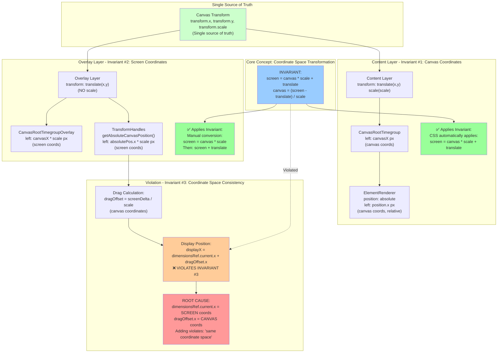

# Canvas Overlay Coordinate Mapping Analysis

## Core Concept

**Coordinate Space Transformation** is the invariant that governs all positioning in the canvas system:

```
Canvas Coordinates (logical space) ↔ Screen Coordinates (pixel space)
```

The transformation function is:
- **Canvas → Screen**: `screen = canvas * scale + translate`
- **Screen → Canvas**: `canvas = (screen - translate) / scale`

This concept must be consistently applied across all positioning calculations. **Any deviation from this invariant causes misalignment.**

## Invariants

1. **Content Layer**: Elements are positioned in **canvas coordinates**. CSS transforms handle the conversion to screen coordinates automatically via `transform: translate(x,y) scale(scale)`.

2. **Overlay Layer**: Overlays are positioned in **screen coordinates** (pre-multiplied by scale). The overlay container only translates, so overlays must manually apply scale before positioning.

3. **Coordinate Space Consistency**: When adding deltas to positions, both values MUST be in the same coordinate space. Mixing coordinate spaces violates the invariant and causes bugs.

4. **Single Source of Truth**: The canvas transform (`transform.x`, `transform.y`, `transform.scale`) is the single source of truth for coordinate transformations. All coordinate conversions must reference this transform.

## Overview

This document traces the coordinate transformation system for both the content layer (which scales with zoom) and the overlay layer (which does not scale, only translates). It identifies where the coordinate mapping diverges from the core concept and violates the invariants.

## Architecture

The canvas uses a two-layer system:

1. **Content Layer**: Scales with zoom (`transform: translate(x,y) scale(scale)`)
2. **Overlay Layer**: Only translates, does not scale (`transform: translate(x,y)`)

This separation allows overlay controls (handles, borders) to maintain constant line thickness regardless of zoom level.

## Content Layer Positioning

### Root Timegroups

**File**: `CanvasRootTimegroup.tsx`

```153:156:telecine/services/web/app/components/motion-designer/canvas/CanvasRootTimegroup.tsx
      style={{
        left: `${currentX}px`,
        top: `${currentY}px`,
        userSelect: "none",
      }}
```

- Positioned using `left` and `top` in **canvas coordinates** (`canvasPosition.x`, `canvasPosition.y`)
- Parent container has `transform: translate(x,y) scale(scale)` applied
- Final screen position: `(canvasX * scale + translateX, canvasY * scale + translateY)`

### Child Elements

**File**: `ElementRenderer.tsx` → `layoutStyles.ts`

```9:13:telecine/services/web/app/components/motion-designer/rendering/styleGenerators/layoutStyles.ts
  if (element.props.position) {
    styles.position = element.props.positionMode || "absolute";
    styles.left = `${element.props.position.x}px`;
    styles.top = `${element.props.position.y}px`;
  }
```

- Child elements use CSS `position: absolute` with `left` and `top` in **canvas coordinates**
- Positioned **relative to parent** in the DOM hierarchy
- When parent scales, CSS automatically scales child positions
- Nested positioning works correctly because CSS handles the transform cascade

## Overlay Layer Positioning

### Root Timegroup Overlays

**File**: `CanvasRootTimegroupOverlay.tsx`

```238:243:telecine/services/web/app/components/motion-designer/canvas/CanvasRootTimegroupOverlay.tsx
  // Overlay must be positioned and sized in screen coordinates
  // Since overlay parent only translates (no scale), we must apply scale here
  const screenX = canvasPosition.x * canvasScale;
  const screenY = canvasPosition.y * canvasScale;
  const screenWidth = dimensionsRef.current.width * canvasScale;
  const screenHeight = dimensionsRef.current.height * canvasScale;
```

```260:264:telecine/services/web/app/components/motion-designer/canvas/CanvasRootTimegroupOverlay.tsx
      style={{
        left: `${screenX}px`,
        top: `${screenY}px`,
        width: `${screenWidth}px`,
        height: `${screenHeight}px`,
```

- Calculates screen coordinates by multiplying canvas coordinates by `canvasScale`
- Parent container has `transform: translate(x,y)` (NO scale)
- Final screen position: `(canvasX * scale + translateX, canvasY * scale + translateY)`
- **This works correctly** because it matches the content layer calculation

### Child Element Overlays

**File**: `TransformHandles.tsx`

#### Position Calculation

```14:43:telecine/services/web/app/components/motion-designer/canvas/TransformHandles.tsx
// Calculate absolute canvas position by walking up parent hierarchy
function getAbsoluteCanvasPosition(
  element: ElementNode,
  state: MotionDesignerState,
): { x: number; y: number } {
  let x = element.props.position?.x ?? 0;
  let y = element.props.position?.y ?? 0;
  
  let currentId = element.parentId;
  while (currentId) {
    const parent = state.composition.elements[currentId];
    if (!parent) break;
    
    // Root timegroups use canvasPosition, nested elements use position
    if (parent.type === "timegroup" && parent.parentId === null) {
      const canvasPos = parent.props.canvasPosition || { x: 0, y: 0 };
      x += canvasPos.x;
      y += canvasPos.y;
      break;
    } else {
      const parentPos = parent.props.position || { x: 0, y: 0 };
      x += parentPos.x;
      y += parentPos.y;
    }
    
    currentId = parent.parentId;
  }
  
  return { x, y };
}
```

```92:97:telecine/services/web/app/components/motion-designer/canvas/TransformHandles.tsx
        // Calculate absolute canvas position from props (matching CanvasRootTimegroupOverlay approach)
        const absolutePos = getAbsoluteCanvasPosition(element, state);
        
        // Multiply by scale to get overlay position (matching CanvasRootTimegroupOverlay)
        const scaledX = absolutePos.x * canvasScale;
        const scaledY = absolutePos.y * canvasScale;
```

- Calculates **absolute canvas position** by summing parent positions
- Multiplies by `canvasScale` to get screen coordinates
- Stores in `dimensionsRef.current.x` and `dimensionsRef.current.y`

#### Dragging Issue

```161:166:telecine/services/web/app/components/motion-designer/canvas/TransformHandles.tsx
      if (isDragging) {
        const screenDeltaX = e.clientX - dragStart.x;
        const screenDeltaY = e.clientY - dragStart.y;
        const canvasDeltaX = screenDeltaX / canvasScale;
        const canvasDeltaY = screenDeltaY / canvasScale;
        setDragOffset({ x: canvasDeltaX, y: canvasDeltaY });
```

```279:281:telecine/services/web/app/components/motion-designer/canvas/TransformHandles.tsx
  // Use canvas coordinates (already accounting for scale)
  const displayX = isDragging ? dimensionsRef.current.x + dragOffset.x : dimensionsRef.current.x;
  const displayY = isDragging ? dimensionsRef.current.y + dragOffset.y : dimensionsRef.current.y;
```

**THE BUG**: 
- `dimensionsRef.current.x` is in **screen coordinates** (already scaled: `absolutePos.x * canvasScale`)
- `dragOffset.x` is in **canvas coordinates** (not scaled: `screenDeltaX / canvasScale`)
- Adding them together mixes coordinate spaces!

The comment on line 279 says "Use canvas coordinates (already accounting for scale)" which is contradictory - it's actually using screen coordinates.

## Root Cause: Violation of Coordinate Space Invariant

The fundamental issue is a **violation of Invariant #3** (Coordinate Space Consistency) in `TransformHandles.tsx`:

1. **Position calculation** (lines 96-97): ✅ Correctly applies the invariant: `screen = canvas * scale`
2. **Drag offset calculation** (lines 164-165): ✅ Correctly applies the invariant: `canvas = screen / scale`  
3. **Display position** (lines 280-281): ❌ **VIOLATES THE INVARIANT** by adding canvas coordinates to screen coordinates

The bug occurs because the code violates the core concept: **when adding deltas to positions, both must be in the same coordinate space**.

### Expected Behavior (Following the Invariant)

When dragging, the overlay must maintain coordinate space consistency. Since `dimensionsRef.current.x` is in screen coordinates (per Invariant #2), the drag offset must also be in screen coordinates:

**Option 1: Work entirely in screen coordinates** (Recommended - simpler, matches overlay layer semantics)

```typescript
// CORRECT: Both values in screen coordinates
const displayX = isDragging 
  ? dimensionsRef.current.x + (e.clientX - dragStart.x)  // screen delta + screen position
  : dimensionsRef.current.x;
```

**Option 2: Convert canvas delta to screen coordinates**

```typescript
// CORRECT: Convert canvas delta to screen before adding
const displayX = isDragging 
  ? dimensionsRef.current.x + (dragOffset.x * canvasScale)  // apply invariant: screen = canvas * scale
  : dimensionsRef.current.x;
```

### Current (Broken) Behavior

```typescript
// BROKEN: Violates Invariant #3 - mixing coordinate spaces
const displayX = isDragging 
  ? dimensionsRef.current.x + dragOffset.x  // screen coords + canvas coords = INVALID
  : dimensionsRef.current.x;
```

This violates the core concept because it attempts to add values from different coordinate spaces without applying the transformation invariant.

## Mermaid Diagram



## Summary

The overlay positioning system violates the **Coordinate Space Transformation** invariant when dragging child elements:

- **Static positioning**: ✅ Correctly applies the invariant (`screen = canvas * scale`)
- **Dragging**: ❌ Violates Invariant #3 by mixing coordinate spaces

## Fix Strategy

To restore the invariant, choose one approach and apply it consistently:

1. **Work entirely in screen coordinates** (Recommended):
   - Change drag calculation to store screen deltas directly
   - Add screen delta to screen position
   - Aligns with overlay layer semantics (everything in screen coords)

2. **Convert before adding**:
   - Keep drag offset in canvas coordinates
   - Apply transformation invariant when adding: `screenPosition + (canvasDelta * scale)`
   - Maintains canvas coordinate semantics but requires conversion

**Key Principle**: The fix must enforce the invariant that **all values being added together must be in the same coordinate space**. The transformation function (`screen = canvas * scale + translate`) must be applied consistently, never bypassed or mixed.

